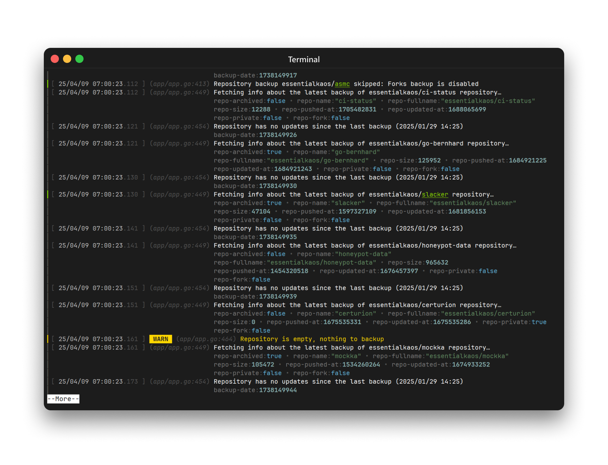

<p align="center"><a href="#readme"></a></p>

<p align="center">
  <a href="https://kaos.sh/w/lj/ci-push"></a>
  <a href="https://kaos.sh/w/lj/codeql"></a>
  <a href="#license"></a>
</p>

<p align="center"><a href="#installation">Installation</a> • <a href="#upgrading">Upgrading</a> • <a href="#usage">Usage</a> • <a href="#ci-status">CI Status</a> • <a href="#license">License</a></p>

<br/>

`lj` is is a tool for viewing JSON logs.

### Screenshots

<p align="center"></p>

### Installation

#### From source

To build the `lj` from scratch, make sure you have a working Go 1.23+ workspace (_[instructions](https://go.dev/doc/install)_), then:

```
go install github.com/essentialkaos/lj@latest
```

#### Prebuilt binaries

You can download prebuilt binaries for Linux and macOS from [EK Apps Repository](https://apps.kaos.st/lj/latest):

```bash
bash <(curl -fsSL https://apps.kaos.st/get) lj
```

### Upgrading

Since version `0.3.0` you can update `lj` to the latest release using [self-update feature](https://github.com/essentialkaos/.github/blob/master/APPS-UPDATE.md):

```bash
lj --update
```

This command will runs a self-update in interactive mode. If you want to run a quiet update (_no output_), use the following command:

```bash
lj --update=quiet
```

> [!NOTE]  
> Please note that the self-update feature only works with binaries that are downloaded from the [EK Apps Repository](https://apps.kaos.st/lj/latest). Binaries from packages do not have a self-update feature and must be upgraded via the package manager.

### Command-line completion

You can generate completion for `bash`, `zsh` or `fish` shell.

Bash:
```bash
sudo lj --completion=bash 1> /etc/bash_completion.d/lj
```

ZSH:
```bash
sudo lj --completion=zsh 1> /usr/share/zsh/site-functions/lj
```

Fish:
```bash
sudo lj --completion=fish 1> /usr/share/fish/vendor_completions.d/lj.fish
```

### Man documentation

You can generate man page using next command:

```bash
lj --generate-man | sudo gzip > /usr/share/man/man1/lj.1.gz
```

### Usage

<p align="center"></p>

### CI Status

| Branch | Status |
|--------|----------|
| `master` | [](https://kaos.sh/w/lj/ci-push?query=branch:master) |
| `develop` | [](https://kaos.sh/w/lj/ci-push?query=branch:develop) |

### Contributing

Before contributing to this project please read our [Contributing Guidelines](https://github.com/essentialkaos/.github/blob/master/CONTRIBUTING.md).

### License

[Apache License, Version 2.0](http://www.apache.org/licenses/LICENSE-2.0)

<p align="center"><a href="https://kaos.dev"></a></p>
